# Trilingo

A React Native mobile application of trilingual dictionary for English · French · Spanish.

Created by: Kiiro Huang (1011781957)

E-mail: kiiro.huang@mail.utoronto.ca

## Video Demo

[](https://youtu.be/4JJaNDeK9L4)

## Motivation

Learning new words in multiple languages often feels fragmented. Dictionary apps typically separate English, French, and
Spanish into different interfaces, and switching between them is slow and unintuitive. For students or multilingual
learners who frequently compare meanings across languages, this friction accumulates into real cognitive load. This made
me look for a more fluid experience, one where the three languages sit side by side and a single query instantly reveals
cross-lingual connections.

_Trilingo_ was designed as a lightweight and efficient tool for multilingual lookup. Fast search, straightforward
presentation, and smooth movement between related words form the core experience. The focus is on reducing friction and
keeping the interface straightforward, allowing users to access the information they need without unnecessary steps or
distractions.

While some web-based resources (e.g., [Logos Dictionary](https://www.logos.it/)) support multilingual search, they are
not optimized for mobile use and often feel outdated in design. _Trilingo_ offers a mobile-first interface with a more
modern and responsive layout, making cross-language lookup easier on both iOS and Android.

## Objectives

The primary goal of _Trilingo_ is to create an interactive English-French-Spanish dictionary application that helps
users explore and compare meanings across languages. It enables learners to discover equivalent words and semantic
relationships in a unified trilingual view.

## Technical Stack

_Trilingo_ is built with **React Native** and **Expo** using **TypeScript** across the entire codebase. The project uses
**Expo Router** for file-based navigation, where screens are defined by their file paths, which enables shared layouts
and improves maintainability. Tabs (Search/Saved/Me) are organized using a router group `(tabs)`, and navigation between
screens is handled through dynamic routes.

State is managed with **Redux Toolkit**, which provides a predictable structure for handling user information, browsing
history, saved words, notification preferences, and navigation-related temporary state. Data that needs to persist
across sessions is stored with **Async Storage**, ensuring that history, saved entries, and preferences remain available
after restarting the app or signing in again. The integration between Redux slices and Async Storage is implemented
through **Redux Thunks** that load data when the app starts and save updates whenever the user performs an action that
modifies the corresponding part of the state.

The app integrates with a **FastAPI** backend for trilingual search. User authentication is handled with
**Supabase Auth**, which includes sign-in, sign-up, session persistence, and provides the session token used for
authorized backend requests. The app also uses **Expo Notifications** for optional daily reminders.

Mobile deployment uses **EAS Build** for native binaries and **EAS Update** for publishing updates and generating Expo
Go preview links.

## Features

### Multilingual Search

The app centers around a fast multilingual search experience designed for English, French, and Spanish.

The Search tab updates in real time as the user types in the search bar. Each change to the query triggers
`useLanguages` hook, which calls the backend and returns the set of pivot languages in which the entered word exists.
This keeps the returned results aligned with the latest underlying corpora as the dataset evolves.

<div style="display: flex; justify-content: space-around; align-items: center;">
    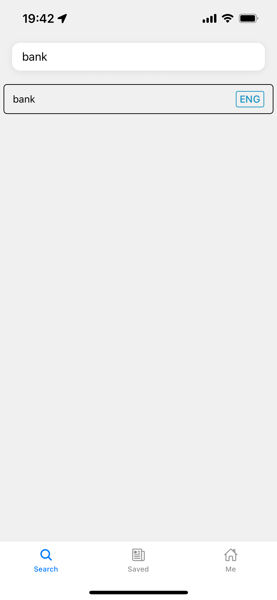
    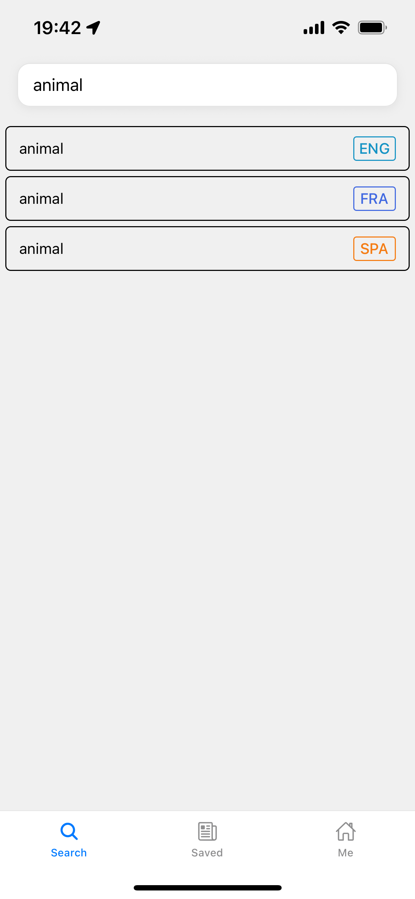
</div>

The screen then constructs a list of entries rendered with the `RecordList` component, showing the headword together
with every available pivot language. This provides a fluid way to explore vocabulary without switching modes or language
tabs. Pressing any row navigates to the Word screen through the dynamic route `/word/[headword]/[pivot]`.

### Word Details

The Word screen displays the full set of meanings for a given word using the `(headword, pivot)` parameters obtained
from the dynamic route. After decoding the headword, the screen calls `useSynsets` hook to fetch all synonym sets
associated with that word in the selected language.

The screen renders the resulting synsets with a `FlatList`, where each item is shown using `SynsetCard`. Each card
presents the synset’s ID, gloss, and its aligned lemma groups in English, French, and Spanish. These parallel lemma
lists provide a compact view of how the same meaning appears across the three languages.

Within each synset card, every lemma is rendered as a pressable element. Selecting a lemma triggers a new word lookup by
using that lemma as the next `headword` and assigning its associated language as the new `pivot`. The screen then
navigates to the corresponding Word route, allowing the user to continue exploring vocabulary directly from the lemmas
listed in the current entry.

Pressing a synset card opens its detail view at the `/synset/[id]` route.

### Synset Details and Synset Stack

A synset represents a single meaning, including its definition, usage examples, and related-word links. The Synset
Detail screen receives the synset ID from the route and uses this ID to locate the corresponding synset inside a
Redux-managed stack.

When a synset card is pressed, the app pushes that synset into this stack together with its ID, then navigates to the
Synset Detail route. The Synset screen reads the data from this stack using the ID from the route, so it can render the
full meaning, examples, and links without issuing a new backend request.

Each further step into a related synset adds another entry on top of the stack. Going back removes the most recent entry
before calling `router.back()`, which restores the previous synset in the order it was visited. This stack-based flow
maintains a clear navigation sequence even when users follow several related meanings in a row.

### Search History Tracking

The History feature helps users revisit vocabulary they explored earlier without needing to repeat searches.

It is implemented through a dedicated Redux slice that records visited `(headword, pivot)` pairs. Each time the user
opens a Word screen, the screen dispatches `refreshHistoryAsync` thunk, which performs a deduplicated upsert into the
slice, and writes the entry into Async Storage under the current user’s namespace.

History is rendered inside the Search tab whenever the query is empty or when no matches are found across the three
languages. Ordering is applied in the corresponding selector, which sorts history entries by timestamp so that the most
recent ones appear first. The Search tab displays the History slice through the shared `RecordList` component, reusing
the same rendering UI.

### Saved Words List

The Saved Words feature allows users to maintain a personalized list of entries they want to revisit later.

Saved Words shares the same underlying technical structure with History: both use a Redux slice backed by Async Storage,
with persistence handled through asynchronous actions. Toggling the star icon on the Word screen modifies the saved list
for the current account, and the Saved tab reads from this slice and renders the latest version of this list.

Additionally, each saved entry includes its full synset data. This design provides offline support, which is an advanced
feature required for the course. Since the list is restored directly from Async Storage at startup, users can open the
Saved tab and continue navigating into any previously saved entry even without a network connection.

### Daily Reminder Notification

The daily reminder system allows users to schedule a single local notification that prompts them to review their saved
entries.

Reminder settings are stored in a dedicated preference slice in Redux, which tracks whether reminders are enabled and
the user’s chosen delivery time. These preferences are persisted in Async Storage under the current account and restored
automatically on startup.

The configuration logic is handled in the Me tab. When the user enables reminders, the app requests notification
permissions and, if granted, schedules a repeating local notification using Expo Notifications. Scheduling follows the
same logic: any existing reminder is canceled, and a new daily notification is created using the current preference from
the slice, whether the change comes from enabling the feature or adjusting the time.

<div style="display: flex; justify-content: space-around; align-items: center;">
    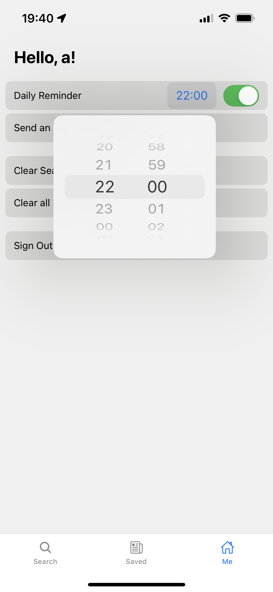
    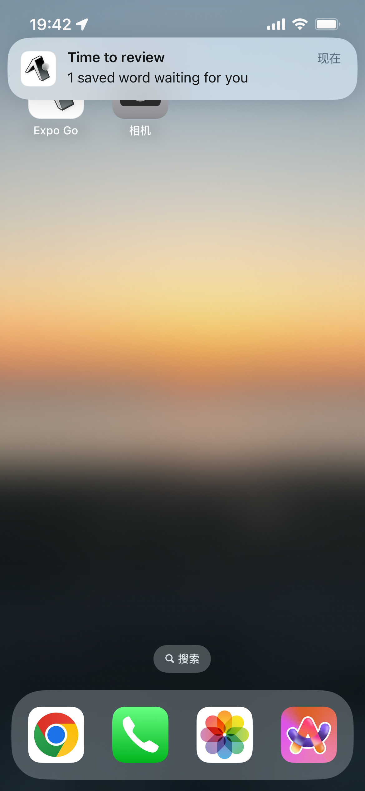
</div>

The content of the reminder is generated on-device and includes the number of saved entries added today, computed from
the Saved slice without relying on backend requests. Because notification scheduling and content resolution occur
locally, the feature operates independently of network connectivity or authentication.

A notification response listener is registered at the layout level so that interacting with a reminder routes the user
directly to the Saved tab when the app is opened from a notification.

### User Authentication

User authentication is implemented with Supabase Auth and follows the session-based model. The app supports sign-in and
sign-up using email and password, and Supabase manages session creation, persistence, and token refresh.

On every app launch, a thunk retrieves the current authentication session from Supabase’s built-in AsyncStorage
integration (`persistSession: true`), and writes the result into the user slice so that navigation and user-scoped data
can load consistently with the current authentication state.

Authentication changes also act as a boundary for loading local data. After the user slice updates, the app loads
History, Saved Words, and notification preferences from Async Storage under the correct account namespace. This keeps
guest data and authenticated data separated without requiring backend storage.

Signing out clears the session in Supabase and resets the user slice. Because the backend requires an authenticated
request and the app does not provide a guest token, the user cannot access the trilingual search API while signed out.
As a result, the app returns to the Sign In / Sign Up screen after logout, and functionality resumes only after the user
signs in again.

### Backend Integration

A lightweight back-end is implemented via Python with FastAPI to align English/French/Spanish lemmas
using [NLTK library](https://www.nltk.org/) of WordNet. For NLTK corpora
data, [Open Multilingual Wordnet (omw-1.4)](https://www.nltk.org/nltk_data/) is used.

The server exposes two public endpoints for the mobile client: one for language detection (returning which languages
contain a given headword), and one for retrieving the aligned synset records. The examples below illustrate the formats
used by the application.

#### Language Detection Endpoint

This endpoint determines which languages contain the queried word.

##### API Endpoint

`GET /api/languages?q={query}`

##### Response Body

The server returns the list of languages in which the queried word appears.

```json
{
  "query": "animal",
  "languages": [
    "eng",
    "fra",
    "spa"
  ]
}
```

#### Synset Alignment Endpoint

##### API Endpoint

`POST /api/align`

##### Request Body

The client sends a word (query) and a pivot language (pivot).

```json
{
  "query": "bank",
  "pivot": "eng"
}
```

##### Response Body

The server returns all synsets containing that word, including:

- **id:** synset ID

- **pos:** word type (noun, verb, etc.)

- **gloss:** definition of this synset

- **lemmas:** aligned lemmas in English, French, and Spanish

- **examples:** example sentences

```json
{
  "pivot": "eng",
  "headword": "bank",
  "synsets": [
    {
      "id": "bank.n.01",
      "pos": "noun",
      "gloss": {
        "eng": "sloping land (especially the slope beside a body of water)"
      },
      "lemmas": {
        "eng": [
          "bank"
        ],
        "fra": [
          "banque",
          "rive"
        ],
        "spa": [
          "margen",
          "orilla",
          "vera"
        ]
      },
      "examples": {
        "eng": [
          "they pulled the canoe up on the bank",
          "he sat on the bank of the river and watched the currents"
        ]
      }
    },
    {
      "id": "deposit.v.02",
      "pos": "verb",
      "gloss": {
        "eng": "put into a bank account"
      },
      "lemmas": {
        "eng": [
          "deposit",
          "bank"
        ],
        "fra": [
          "banque",
          "déposer"
        ],
        "spa": [
          "depositar",
          "ingresar"
        ]
      },
      "examples": {
        "eng": [
          "She deposits her paycheck every month"
        ]
      }
    }
  ]
}
```

## User Guide

### Sign-In Screen / Sign-Up Screen

URL: `/sign-in`, `/sign-up`

<div style="display: flex; justify-content: space-around; align-items: center;">
    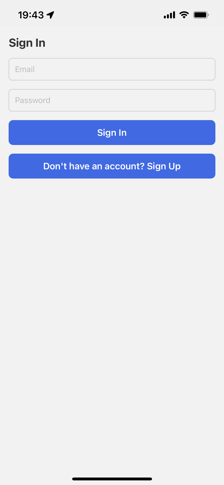
    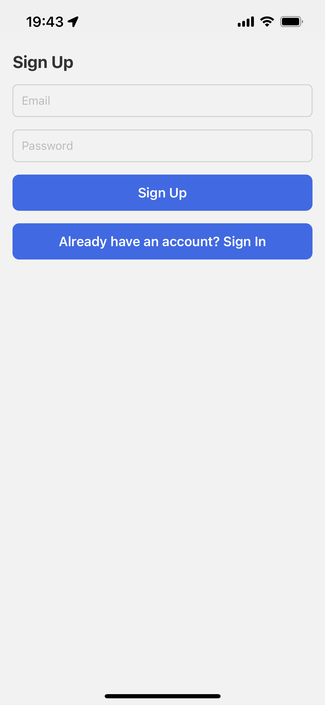
</div>

When the app launches and there is no active Supabase session, it always shows the Sign In screen first. The user must
sign in or sign up before they can access the main tab navigator and use any features.

The Sign-In screen provides email and password fields and a primary `Sign In` button. A secondary text button at the
bottom links to the Sign Up screen. The Sign-Up screen mirrors this layout: email, password, a `Sign Up` button, and a
link back to Sign In.

After a successful sign-in or sign-up, the app replaces the auth stack with the main tab layout and opens on the Search
tab. When the user taps `Sign Out` later (from the Me tab), the session is cleared and the app returns to the Sign In
screen.

### Search Screen

URL: `/(tabs)/`

<div style="text-align: center;">
  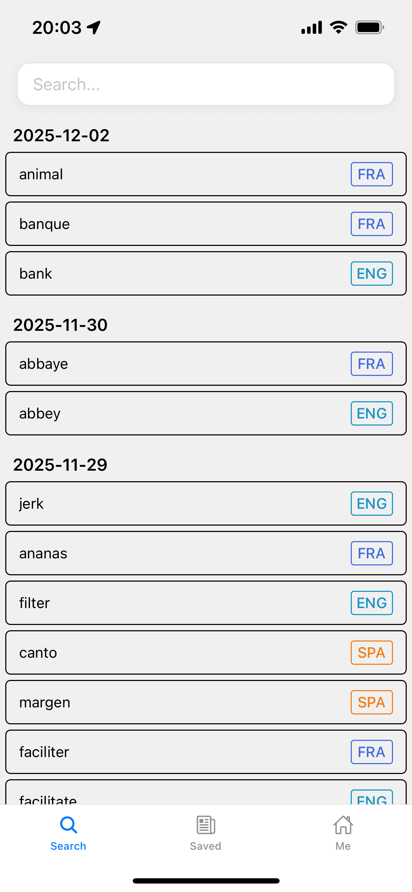
</div>

After authentication, the user lands on the Search tab. This is the main entry point for exploring vocabulary.

At the top of the screen there is a search bar; the user can type any word in English, French, or Spanish. When the user
enters a query that has results in multiple languages, the screen shows a short list of candidate entries, each with a
language badge on the right. Tapping one of these rows chooses the pivot language and navigates to the Word screen for
that `(headword, pivot)` pair.

When the search bar is empty, the Search tab shows the user’s recent history instead of the language selection list.
Recent entries are grouped by date with most recent date at the top, and each row displays the headword and its pivot
language badge. Tapping a history entry behaves the same as a fresh search and opens the Word screen.

Search History is stored per account. It can be cleared from the Me tab, which immediately removes all sections from the
history view.

### Word Screen

URL: `/word/[headword]/[pivot]`

<div style="text-align: center;">
  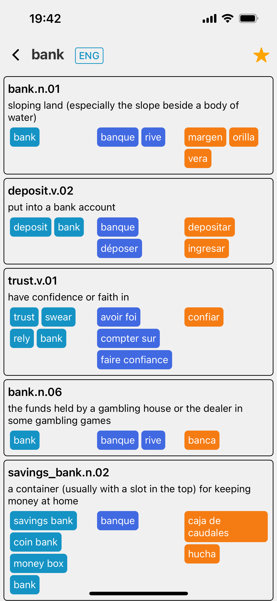
</div>

The Word screen shows all synsets of the searched word in different languages.

The header shows the headword and the pivot language, along with a star icon on the right. If the current (headword,
pivot) pair is not in the user’s saved list, the star appears unfilled; tapping it saves the word and updates both the
Saved tab and the star state. If the word is already saved, the star appears filled and tapping it removes the word from
the saved list.

The main content is a scrollable list of synset cards. Each card includes:

- The synset ID and its part of speech.

- The gloss (definition) in the pivot language.

- Lemma chips in three colors corresponding to English, French, and Spanish. Each chip shows a lemma aligned to this
  synset.

Tapping a lemma chip triggers a new search using that lemma as the headword and its language as the pivot, then
navigates to the corresponding Word screen. Tapping the card background (anywhere outside the chips) navigates to the
Synset screen for that specific synset.

### Synset Screen

URL: `/synset/[id]`

<div style="text-align: center;">
  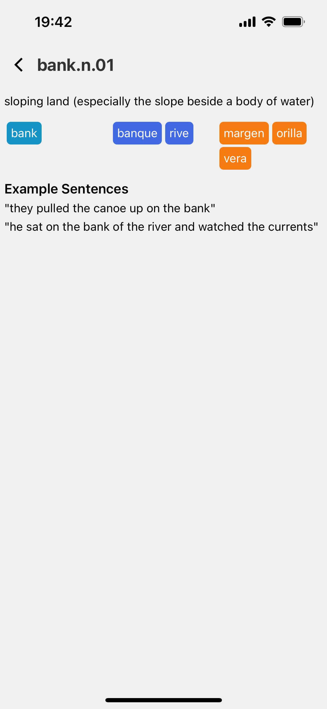
</div>

The Synset screen focuses on a single meaning. At the top, it displays a back arrow and the synset ID with its part of
speech (for example, `bank.n.01`). The gloss appears directly underneath as a short explanatory sentence.

Below the gloss, the app shows the aligned lemma chips for English, French, and Spanish. Tapping any of these chips
navigates to the Word screen for that lemma in its own language, allowing the user to branch out quickly to related
words.

If example sentences are available, they appear in an “Example Sentences” section at the bottom of the screen. Each
sentence is rendered as plain text, giving the user concrete usage examples before they decide whether to save or
further explore the word.

### Saved Screen

URL: `/(tabs)/saved`

<div style="text-align: center;">
  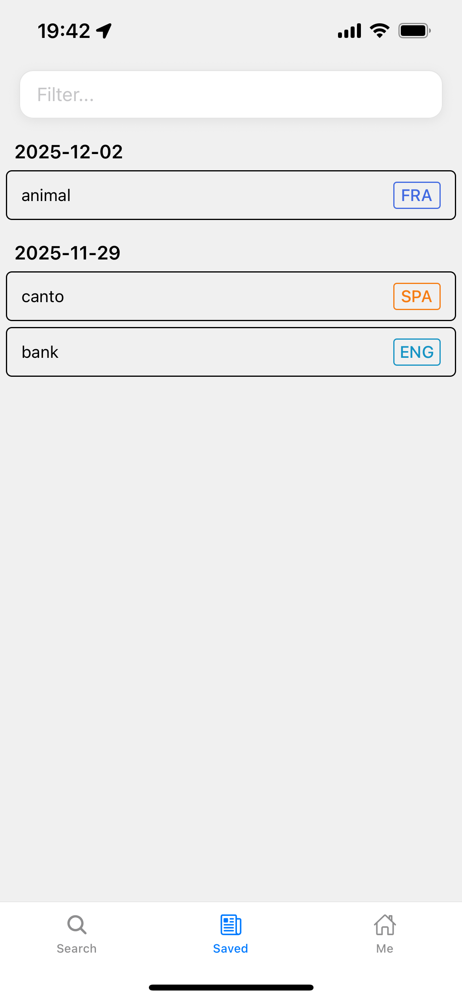
</div>

The Saved screen shows the user’s personal vocabulary list, synchronized with their account.

At the top, a filter input with the placeholder `Filter…` allows the user to narrow down saved words. Typing in this
field performs a local filter on the saved entries, which does not trigger additional network calls. When the field is
empty, all saved words are visible.

The list itself is grouped by the date when each word was saved. Under each date header, every row shows a headword and
its pivot language badge. Tapping a row navigates to the Word screen for that word, where the user can review meanings
or unsave it using the star icon.

If the user clears all saved words from the Me tab, this screen will immediately become empty until new words are added.

### Me Screen

URL: `/(tabs)/me`

<div style="text-align: center;">
  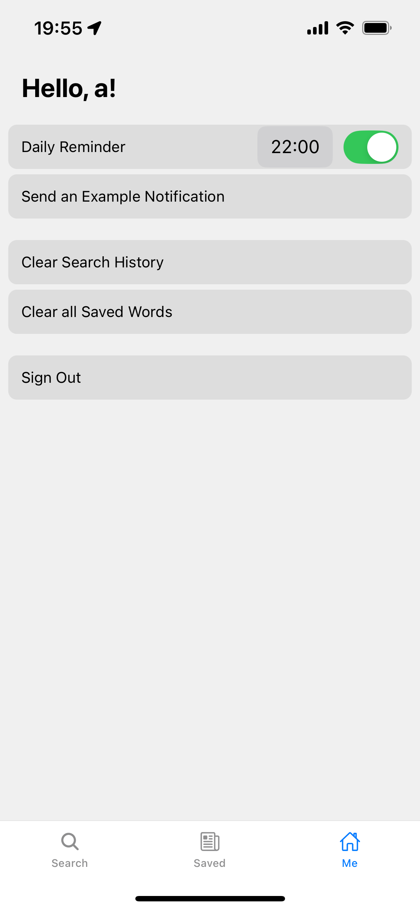
</div>

The Me tab contains user-specific settings and maintenance actions.

At the top, the screen greets the user using the part of their email before the `@` symbol (for example, `Hello, a!`).
The first row configures the Daily Reminder feature. On the left is the label, in the middle a tappable time value (such
as `23:00`), and on the right a toggle switch. When a user enables the reminder for the first time, the time defaults to
`20:00`, unless they choose another value afterward.

Turning the switch on enables the daily notification and schedules a local reminder at the configured time. If
notification permission has not yet been granted, the app asks the system for permission first. Tapping the time opens
the native time picker; once the user confirms a new time, the preference is saved and the reminder schedule is updated
accordingly. Turning the switch off cancels the existing daily reminder.

Below the reminder row, there is a button to `Send an Example Notification`, which fires an immediate one-off
notification so the user can verify that alerts are working.

Two additional rows provide maintenance actions: `Clear Search History`, which removes all entries from the Search tab’s
history, and `Clear all Saved Words`, which deletes every word in the current account’s saved list.

Finally, a `Sign Out` row ends the Supabase session and returns the app to the Sign In screen. After signing out,
history,
saved words, and preferences for that account are no longer shown until the user signs in again.

## Development Guide

### Setup Development Environment

After cloning the repository, install all required packages with:

```bash
npm install
```

The application relies on several environment variables for backend communication and authentication. Before running the
app, create a local `.env` file by copying the example file:

```bash
cp .env.example .env
```

Then update the file with your own environment variables. The structure is as follows:

```text
EXPO_PUBLIC_API_BASE_URL=https://api.kiiroh.tech

EXPO_PUBLIC_SUPABASE_URL=https://your-project-id.supabase.co
EXPO_PUBLIC_SUPABASE_PUBLIC_KEY=your-public-api-key
```

Credentials sent to TA.

These variables are automatically injected into the JavaScript runtime by Expo and can be accessed via `process.env`.

### Supabase Setup

1. Create a new project on [Supabase](https://supabase.com/).
2. Go to `Authentication` > `Sign In / Providers` and verify that the `Email` sign-in method is enabled.
3. Go to `Project Settings` > `Data API` to find the project URL.
4. Go to `Project Settings` > `API Keys` > `Legacy anon, service_role API keys` to find the public API key.
5. Copy the project URL and public API key to the `.env` file.

No additional database schema configuration is needed because all user-specific data is stored in the client’s Async
Storage and namespaced by Supabase user ID.

### Run the App Locally

Start the development server using:

```bash
npm start
```

You can test the app in several ways:

- Scan the QR code with the Expo Go app on a physical device.

- Press i to run on an iOS simulator.

- Press a to run on an Android emulator.

## Deployment Information

### Back-end Deployment

The back-end server and the NLTK resources are containerized with **Docker** and deployed to the cloud platform through
DigitalOcean for public access. During the build stage, the required NLTK corpora are pre-downloaded to ensure the
service can run without external downloads at runtime.

A new application is created on **DigitalOcean App Platform**, where a single container instance was configured with the
smallest available size (512 MB RAM, 0.5 shared vCPU) to minimize resource usage. The current setup costs USD 5 per
month.

A custom domain name has also been configured, and the API is accessible via https://api.kiiroh.tech.

This domain is used by the mobile client through the environment variable `EXPO_PUBLIC_API_BASE_URL`.

### Mobile-end Deployment

#### Android APK

A standalone Android APK is produced through **EAS Build**. To generate an APK:

```bash
npm run eas:build:android
```

Then the APK is available in the EAS Build dashboard for download.

#### Expo Go Link

For iOS devices or anyone who prefers testing through Expo Go, the project is also published via **EAS Update**.

To generate an Expo Go Link:

```bash
npm run eas:update -- --message="<some-message-here>"
```

The latest published version can be accessed through this link:

[Expo Go Link](https://expo.dev/preview/update?message=update&updateRuntimeVersion=1.0.0&createdAt=2025-12-02T09%3A34%3A49.369Z&slug=exp&projectId=2823c0f2-975a-4c6b-8d13-9ccb8ce856ad&group=6797ad6f-0924-47ee-bb75-bf222667ccde)

To use this link:

- Install Expo Go from the App Store or Google Play.

- Open the link on your phone or scan the QR code shown by expo start.

- The _Trilingo_ project will load inside Expo Go.

## Individual Contributions

Kiiro Huang: All

## Lessons Learned and Concluding Remarks

This project made a vague idea concrete and forced me to think carefully about how a small mobile app should be
structured end to end. Starting from a simple trilingual lookup tool and arriving at a working application required many
small design decisions around data flow, state, and navigation. Having a focused use case helped a lot, because each
change could be evaluated by a simple question: does this make looking up and revisiting words easier or more confusing.

Working with local persistence turned out to be one of the most instructive parts. Storing history, saved words, and
user preferences directly in Async Storage showed how much of the core experience can live entirely on the device. It
also highlighted that local data needs as much structure as server data. Namespacing keys by user, keeping record shapes
consistent, and separating slices for history, saved words, and preferences all made it easier to reload state in a
predictable way. Keeping this information on the device has a privacy benefit as well, since personal lookup behavior
and reminders do not need to be sent to any backend system.

The project also clarified how different approaches to state and navigation affect maintainability. Early iterations
relied more on passing data directly through routes. As the app grew, especially with deeper navigation through synsets
and related meanings, it became clearer that some parts of the data model are better managed in a shared store.
Introducing a dedicated synset stack in Redux simplified the logic for stepping into and out of related meanings, and
separating user state, preferences, and per user storage into their own slices made the overall flow easier to reason
about.

Notifications and authentication were good examples of features that had to be adjusted multiple times before they felt
stable. The notification system started as a minimal daily reminder and gradually gained support for time selection and
saved word counts. The authentication flow followed a similar path, beginning with basic sign-in and sign-up screens and
evolving into a session aware structure where redirects, user scoped loading, and sign out behavior are coordinated.
These iterations made it clear that getting a feature to "work" is only the first step, and that integrating it cleanly
with the rest of the app often takes several rounds of refinement.

From a broader perspective, this project reinforced a few practical habits. Keeping components small and extracting
shared pieces such as record rendering and badges reduced duplication and made UI changes safer. Using Redux Toolkit and
typed hooks kept state access consistent. Writing small, focused changes and seeing their effect on the whole flow was
also a useful exercise in version control discipline. Overall, the project improved my understanding of how local state,
backend integration, navigation, and user experience fit together in a mobile app, and turned a long standing idea into
a tool that I can actually use and extend.